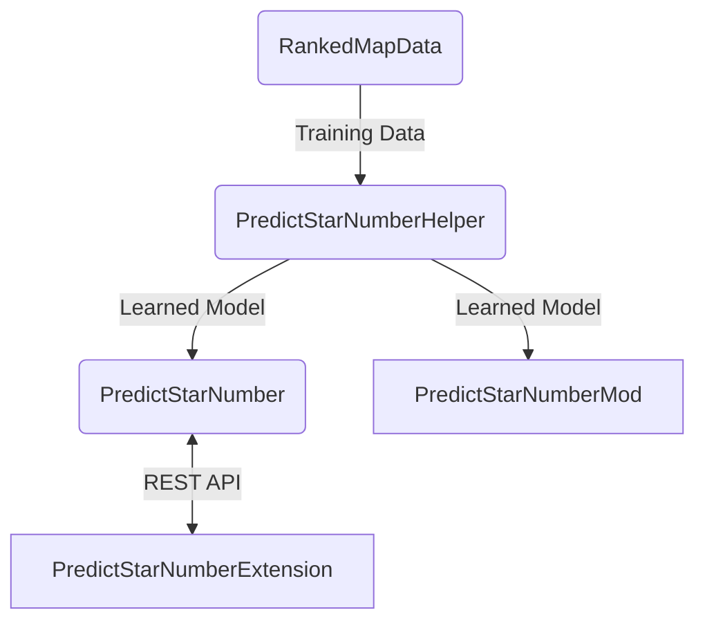

# PredictStarNumber

[RankedMapData](https://github.com/rakkyo150/RankedMapData)
のデータをもとに、BeatSaverで公開されている譜面のScoreSaberのランク基準の星の数を予測するアプリ。<br>
[こちら](https://predictstarnumber.onrender.com)から使えます。<br>
[PredictStarNumberHelper](https://github.com/rakkyo150/PredictStarNumberHelper)のモデルを使用。<br>
BeatSaverのAPIから取得できる情報のみで学習を行ったので、譜面にもよりますが、結構外れた値がでることもあります。<br>
~~なお、学習精度に関しては[PredictStarNumberHelper](https://github.com/rakkyo150/PredictStarNumberHelper)
のmodelScore.jsonで確認できます。<br>
ちなみに、2022/1/3現在の精度は、trainScoreが0.9745135905035479、testScoreが0.9405029861621208です。<br>
学習精度に決定係数を用いるのは不適当だったので、その点は今後改善する予定です。<br>
それに伴って、学習済みモデルの調整も行うかもです。<br>~~
以上で述べた[PredictStarNumberHelper](https://github.com/rakkyo150/PredictStarNumberHelper)の改善は完了してます。

## Relevant Link

Training Data : https://github.com/rakkyo150/RankedMapData <br>
Model : https://github.com/rakkyo150/PredictStarNumberHelper <br>
Mod : https://github.com/rakkyo150/PredictStarNumberMod <br>
Chrome Extension : https://github.com/rakkyo150/PredictStarNumberExtension <br>



## API

### V2-RenderVersion

https://predictstarnumber.onrender.com/api2/doc

### V2(Not available from 2022.12.6)

|Method|URI|Models|
|:---|:---|:---|
|GET|https://predictstarnumber.herokuapp.com/api2/id/{id(!bsr)}|{ characteristic-difficulty : PredictedStarNumber(float) }|
|GET|https://predictstarnumber.herokuapp.com/api2/hash/{hash}|{ characteristic-difficulty : PredictedStarNumber(float) }|
|GET|https://predictstarnumber.herokuapp.com/api2/leaderboardId/{leaderboardId}|{ characteristic-difficulty : PredictedStarNumber(float) }|

### V1(Not available from 2022.12.6)

後方互換性のために古いAPIを残しています<br>
characteristicがStandardの予測値しか取得できません

|Method|URI|Models|
|:---|:---|:---|
|GET|https://predictstarnumber.herokuapp.com/api/id/{id(!bsr)}|{ difficulty : PredictedStarNumber(float) }|
|GET|https://predictstarnumber.herokuapp.com/api/hash/{hash}|{ difficulty : PredictedStarNumber(float) }|
|GET|https://predictstarnumber.herokuapp.com/api/leaderboardId/{leaderboardId}|{ difficulty : PredictedStarNumber(float) }|

### For Local Run
pythonのパッケージマネージャーである[uv](https://github.com/astral-sh/uv)を使うと簡単に実行できます。
```bash
uv sync --locked
uv run apps.py
```
